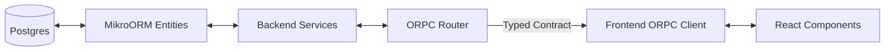

# Monorepo Template

A production-ready, high-performance monorepo template designed for modern full-stack development. Built with speed, scalability, and developer experience in mind.

## Architecture Overview

This template implements a strict, type-safe flow from Database to UI:



- **Backend**: Hono server exposing an ORPC API.
- **Contracts**: Shared package (`packages/contracts`) defining Zod schemas and RPC procedures.
- **Frontend**: React apps consuming the API via a strongly-typed client.

## Features

- **Monorepo Management**: [Turborepo](https://turbo.build/) + [pnpm workspaces](https://pnpm.io/workspaces)
- **Backend**: [Hono](https://hono.dev/) transport + [ORPC](https://orpc.unnoq.com/) API
- **Frontend**: [Vite](https://vitejs.dev/) + [React](https://react.dev/) + [TanStack Router](https://tanstack.com/router)
- **Database**: [MikroORM](https://mikro-orm.io/) + Postgres
- **Type Safety**: Strict TypeScript everywhere, shared contracts via [orpc](https://orpc.unnoq.com/)
- **UI Library**: [shadcn/ui](https://ui.shadcn.com/) + Tailwind CSS
- **Testing**: [Vitest](https://vitest.dev/)
- **Linting**: [oxlint](https://oxc-project.github.io/docs/guide/usage/linter.html) + Prettier
- **Scaffolding**: Built-in generators via `turbo gen`

## Getting Started

### Prerequisites

- Node.js >= 24.11.0
- pnpm >= 10.20.0
- Docker (for local database)

> **Tip:** This repo includes a `.tool-versions` file. If you use [asdf](https://asdf-vm.com/), you can install the exact versions by running:
>
> ```bash
> asdf install
> ```

### Quick Start

1.  **Clone & Setup**

    ```bash
    # Clone into a new directory (e.g., my-app)
    git clone git@github.com:josehdez01/monorepo-fillstack-template.git my-app
    cd my-app

    # Optional: Reset git history to start fresh
    rm -rf .git
    git init
    git add .
    git commit -m "Initial commit"

    # Install dependencies
    pnpm install
    ```

2.  **Setup Environment**

    ```bash
    # Materialize .env files from examples
    pnpm env:setup

    # Optionally verify env wiring across projects
    pnpm env:doctor
    ```

3.  **Start Infrastructure**

    ```bash
    # Starts Postgres & Redis
    pnpm infra:up
    ```

    - Stop services: `pnpm infra:down`

4.  **Initialize Database**

    ```bash
    # Generate entities registry and run migrations
    pnpm -C backend db:entities:gen
    pnpm -C backend db:migrate:up
    ```

5.  **Run Development Servers**

    ```bash
    pnpm dev:all
    ```

    - Backend: http://localhost:3000
    - Frontend (User App): http://localhost:5175

Backend runtime roles

- `ROLE=api`: runs only the HTTP/RPC server; queues are initialized for publishing but workers do not run.
- `ROLE=worker`: runs only queue workers (no HTTP server).
- `ROLE=all` (default): runs both in one process, registering queues before starting workers, then starting the API.

Frontend env defaults

- Frontend `.env.example` files include `VITE_RPC_URL` and enable client-side request validation by default via `VITE_ORPC_VALIDATE_REQUESTS=true`. Set it to `false` to disable local request validation if needed.

## Project Structure

```
.
├── backend/            # Main backend application (Hono)
├── contracts/          # Shared API contracts and Zod schemas
├── frontend/           # Frontend applications
│   ├── landing_page/   # Marketing site
│   ├── user_app/       # Main user dashboard
│   └── admin_app/      # Admin dashboard
├── packages/           # Shared internal libraries
│   ├── ui/             # Design system & UI components
│   ├── env/            # Env parsing helpers for Node/Vite
│   ├── logger/         # Structured logging
│   └── e2e/            # Playwright end-to-end tests
├── infra/              # Infrastructure (Docker Compose)
└── turbo/              # Turborepo configuration & generators
```

## ⚡ Generators

This template uses `@turbo/gen` to automate the creation of new packages and applications. This ensures consistency, type safety, and saves time by handling boilerplate setup.

### Why Generators?

- **Consistency**: All packages start with the same structure, configuration, and dependencies.
- **Type Safety**: New packages are automatically wired up to the TypeScript project references.
- **Speed**: Skip the manual setup of `package.json`, `tsconfig.json`, and folder structures.
- **Best Practices**: Enforces the monorepo's architectural patterns from day one.

### Usage

#### Generate a New Package

Scaffold a new shared library or utility package.

```bash
pnpm gen package
```

**Prompts:**

- **Name**: The name of the package (e.g., `ui`, `logger`, `utils`).
- **Type**: The type of package (e.g., `ui`, `config`, `utility`).

**Example:**

```bash
pnpm gen package --args name=my-utils type=utility
```

#### Generate a New App

Scaffold a new frontend application with Vite, TanStack Router, and ORPC pre-configured.

```bash
pnpm gen app
```

**Prompts:**

- **Name**: The name of the app (e.g., `dashboard`, `marketing`).

**Example:**

```bash
pnpm gen app --args name=dashboard
```

#### Generate a New Queue (Backend)

Create a typed BullMQ queue (via `torero-mq`) with zod input/output and sensible defaults.

```bash
pnpm gen queue
# or non-interactive
pnpm gen queue --args name=email-send
```

The file is created at `backend/src/queues/<name>-queue.ts`. Import it in `backend/src/queues/index.ts` to register it at startup.

#### Generate a New DB Entity + Repository

Scaffold a MikroORM entity and repository.

```bash
pnpm gen db-entity
# or non-interactive
pnpm gen db-entity --args name=Invoice
```

Outputs under `backend/src/db/{entities,repositories}`.

Note: We do not provide an RPC generator by design; follow `backend/src/rpc/README.md` for contract-first patterns and examples.

## 🪄 Mint Your Project

When forking this repo, quickly re-scope all `@template/*` packages to your org scope.

```bash
pnpm mint -- --scope @acme
```

What it does:

- Rewrites workspace package names from `@template/*` to `@acme/*`
- Updates import specifiers `@template/...` across the codebase
- Leaves frontend app names as-is (you can rename later)

Dry run:

```bash
pnpm mint -- --scope @acme --dry
```

## Development Workflow

- **Build**: `pnpm build`
- **Test**: `pnpm test`
- **Lint (fixes)**: `pnpm lint`
- **Lint check (CI)**: `pnpm lint:check`
- **Format**: `pnpm format`
- **Typecheck**: `pnpm typecheck`

## Local Testing

- Start Postgres (Docker) and run tests end-to-end with a fast template DB:
    - `pnpm -C backend test:local`
- After schema changes, force rebuild the template and run tests:
    - `pnpm -C backend test:local:rebuild`
- Optional: customize test env
    - Copy `backend/.env.test.example` to `backend/.env.test.local` and adjust `TEST_DATABASE_URL` if you want tests to use a different Postgres DB than the default `app`.
    - You can also manage services manually with `pnpm -C backend test:db:up` and `pnpm -C backend test:db:down`.
    - More details: `backend/docs/testing.md`.

## Env Typing

- Backend parses env with zod in `backend/src/config/env.ts`.
- Frontend can parse `VITE_*` vars with `@template/env`:

```ts
// frontend/*/src/env.ts
import { z } from 'zod';
import { parseViteEnv } from '@template/env';

export const env = parseViteEnv({
    VITE_RPC_URL: z.string().url(),
});
```

## Entities and IDs

- All entities extend a canonical `BaseEntity` providing an autoincrement `id` and timestamps (`created_at`, `updated_at`).
- Avoid type drift by deriving DTOs from entity definitions and referencing ids from the entity type itself:

```ts
// backend/src/db/entities/user.ts
import type { EntityDTO } from '@mikro-orm/core';

export type User = EntityDTO<typeof UserEntity>;
// Use `User['id']` wherever an id type is needed.
```

- In contracts, brand numeric IDs ad-hoc with `entityId('EntityName')` (`contracts/src/utils/entity-id.ts`) to keep schemas lean while preserving branded types end-to-end.

## License

MIT
